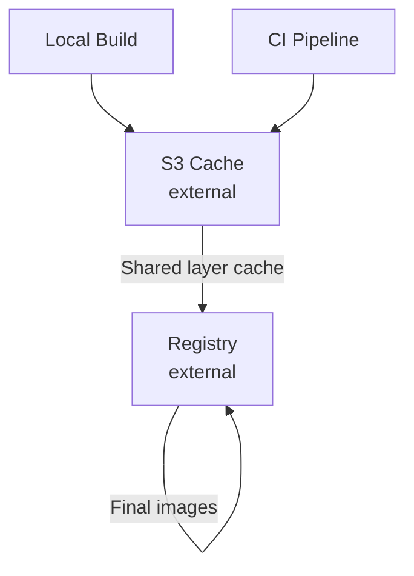
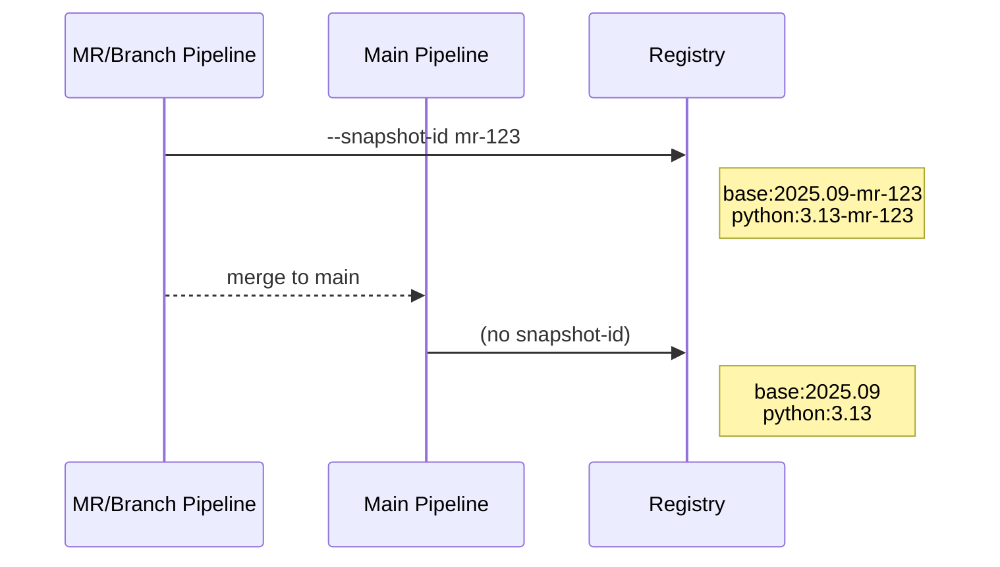
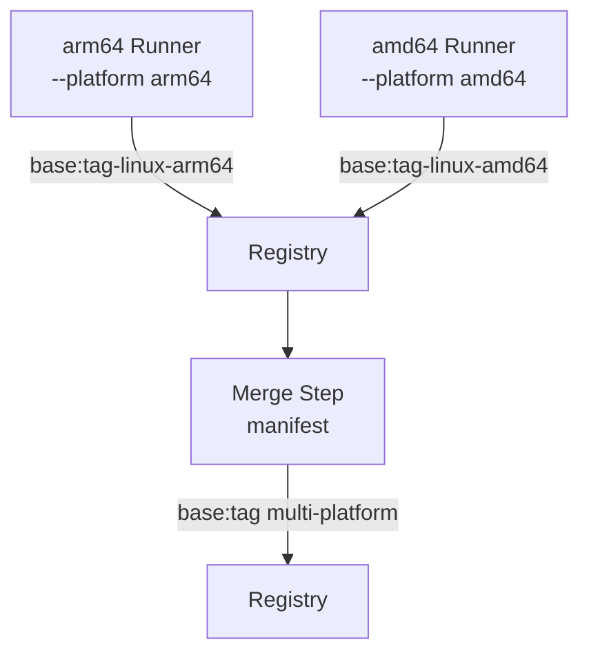
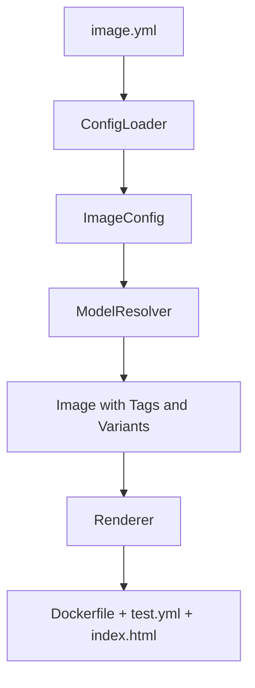
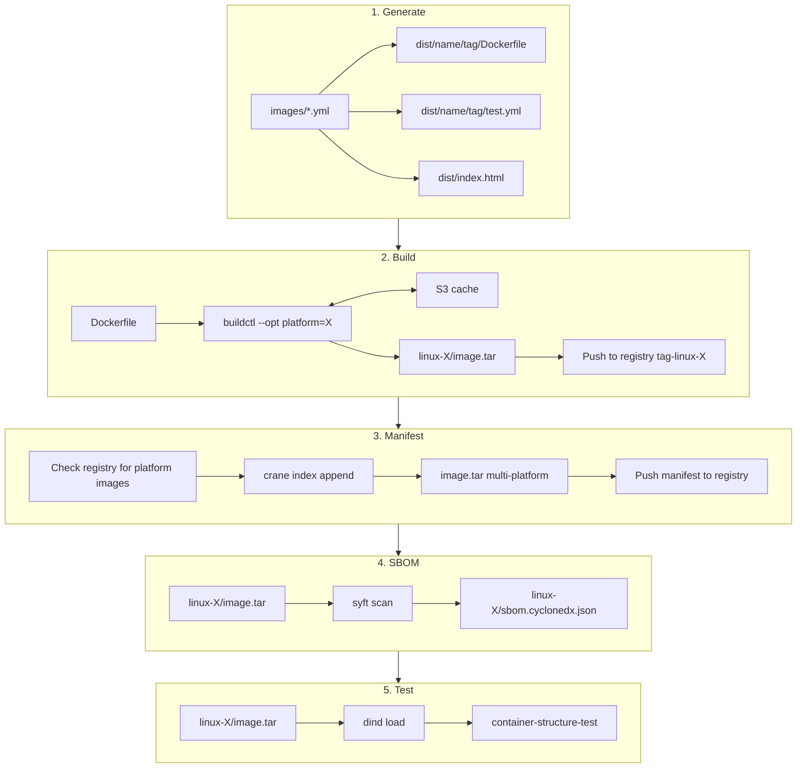
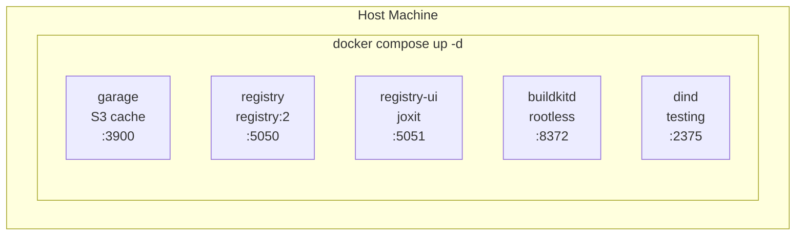

Proof of Concept for (CI) image management
===

> **Note:** This is currently a conceptual proof of concept. The goal is to make this work out of the box on any CI provider (GitHub Actions, GitLab CI, etc.) and locally on macOS and Linux, where the entire toolchain runs in a prebuilt rootless container with no host dependencies beyond Docker.
>
> This codebase was heavily generated using [Claude Code](https://claude.ai/code). Code quality is not a priority - the focus is on demonstrating the overall concept and combining building blocks.

Proof of concept for easy (CI) image management, which is also transferable to any kind of prebuilt images provided;
e.g. runtime images.

## Requirements

- Docker
- uv
- Python 3.13

## Bundled Tools

The following tools are bundled in `bin/` for linux-amd64, linux-arm64, and darwin-arm64:

| Tool | Version | Purpose |
|------|---------|---------|
| [crane](https://github.com/google/go-containerregistry) | v0.20.7 | Multi-tagging images |
| [container-structure-test](https://github.com/GoogleContainerTools/container-structure-test) | v1.22.1 | Image testing |
| [syft](https://github.com/anchore/syft) | v1.39.0 | SBOM generation |
| [buildkit](https://github.com/moby/buildkit) | v0.26.3 | Rootless builds |
| [rootlesskit](https://github.com/rootless-containers/rootlesskit) | v2.3.6 | Rootless wrapper (Linux) |

## Usage

```shell
uv sync
uv run image-manager <command> [args]
```

Commands:
- `generate [--no-lock]` - Generate Dockerfiles and test configs from `images/`
- `generate-ci [options]` - Generate CI pipeline configuration
- `lock <image:tag>` - Generate packages.lock with pinned versions and digest
- `build [image:tag] [options]` - Build image(s) to `dist/<name>/<tag>/image.tar`
- `manifest <image:tag>` - Create multi-platform manifest from registry images
- `sbom [image:tag] [--format FORMAT]` - Generate SBOM for image(s)
- `test [image:tag]` - Test image(s) using the tar archive

Build options:
  --no-cache          Disable S3 build cache
  --platform PLAT     Build for specific platform only (amd64, arm64)
                      Default: builds linux/amd64 + linux/arm64 with multi-platform manifest

Generate CI options:
  --provider PROV     Use built-in template (gitlab, github)
  --template DIR      Use custom template directory
  --output PATH       Output file path (required with --template)
  --artifacts         Enable artifact passing between jobs (opt-in)

Manifest options:
  --snapshot-id ID    Use snapshot ID suffix for registry tags

When no image is specified for `build` or `test`, all images are processed in dependency order.

Output in dist/:
- `index.html` - Image catalog with all images, tags, versions, and platform badges
- `<name>/<tag>/index.html` - Tag report with platform details and SBOM links
- `<name>/<tag>/linux-amd64/image.tar` - AMD64 platform image
- `<name>/<tag>/linux-arm64/image.tar` - ARM64 platform image
- `<name>/<tag>/image.tar` - Multi-platform OCI index (or single platform copy)
- `<name>/<tag>/Dockerfile` - Generated Dockerfile
- `<name>/<tag>/test.yml` - Test configuration
- `<name>/<tag>/rootfs/` - Merged rootfs files (if any)
- `<name>/<tag>/linux-*/sbom.cyclonedx.json` - SBOM per platform

## Example

```shell
# Generate Dockerfiles and test configs
uv run image-manager generate

# Build, generate SBOM, and test all images (in dependency order)
uv run image-manager build
uv run image-manager sbom
uv run image-manager test

# Or work with specific images
uv run image-manager build base:2025.09
uv run image-manager sbom base:2025.09
uv run image-manager test base:2025.09

# Build without S3 cache
uv run image-manager build --no-cache

# Build for specific platform
uv run image-manager build base:2025.09 --platform amd64
uv run image-manager build base:2025.09 --platform arm64

# Build all platforms (default, uses emulation for non-native)
uv run image-manager build base:2025.09

# Create manifest from existing registry images
uv run image-manager manifest base:2025.09

# Generate SBOM in different formats
uv run image-manager sbom --format spdx-json   # SPDX format
uv run image-manager sbom --format json        # Syft native format

# Stop daemons when done
docker compose stop buildkitd dind
```

## Configuration

Create `.image-manager.yml` in your project root to customize settings:

```yaml
# Single registry (legacy format, still supported)
registry:
  url: my-registry.example.com:5000
  username: ${REGISTRY_USERNAME}
  password: ${REGISTRY_PASSWORD}

# Multi-registry support
# Use this when you need to:
# - Pull from private registries (e.g., for base images)
# - Push to a specific registry
registries:
  # Registry to pull from (e.g., private base images)
  - url: ghcr.io
    username: ${GITHUB_USER}
    password: ${GITHUB_TOKEN}

  # Registry to push built images to (marked as default)
  - url: my-registry.example.com:5000
    username: ${REGISTRY_USERNAME}
    password: ${REGISTRY_PASSWORD}
    default: true
```

**Registry configuration:**
- `url`: Registry URL (e.g., `ghcr.io`, `my-registry.com:5000`)
- `username`: Username (supports `${ENV_VAR}` expansion)
- `password`: Password/token (supports `${ENV_VAR}` expansion)
- `default`: Set to `true` for the registry to push images to

If no config file exists, defaults to `localhost:5050`.

### S3 Build Cache

Configure an external S3-compatible cache for shared layer caching between local and CI builds:

```yaml
cache:
  endpoint: ${S3_ENDPOINT}           # e.g., https://s3.amazonaws.com
  bucket: ${S3_BUCKET}               # e.g., my-buildkit-cache
  access_key: ${AWS_ACCESS_KEY_ID}
  secret_key: ${AWS_SECRET_ACCESS_KEY}
  region: us-east-1                  # optional, default: us-east-1
  use_path_style: true               # optional, default: true (for MinIO/Garage)
```

**Cache configuration:**
- `endpoint`: S3-compatible endpoint URL
- `bucket`: Bucket name for storing cache layers
- `access_key`: AWS access key ID (supports `${ENV_VAR}` expansion)
- `secret_key`: AWS secret access key (supports `${ENV_VAR}` expansion)
- `region`: AWS region (optional, default: `us-east-1`)
- `use_path_style`: Use path-style URLs (optional, default: `true` for MinIO/Garage compatibility)

To disable caching entirely:
```yaml
cache: false
```

If no cache config is provided, defaults to local Garage instance at `localhost:3900`.

### OCI Image Labels

Built images automatically include [OCI annotations](https://github.com/opencontainers/image-spec/blob/main/annotations.md). Configure global labels in `.image-manager.yml`:

```yaml
labels:
  vendor: "My Company"
  authors: "Name <email@example.com>"
  url: "https://example.com/images/%image%/%tag%"
  documentation: "https://docs.example.com/%image%"
  licenses: "MIT"
```

**Global label configuration:**
- `vendor`: Organization or company name
- `authors`: Contact details (e.g., `Name <email>`)
- `url`: URL to image info page (supports `%image%` and `%tag%` placeholders)
- `documentation`: URL to documentation (supports `%image%` and `%tag%` placeholders)
- `licenses`: SPDX license expression (can be overridden per-image)

**Per-image labels** in `image.yml`:
```yaml
name: myimage
description: "Human-readable description of the image"
licenses: "Apache-2.0"  # Overrides global licenses
```

**All supported OCI labels:**

| Label | Source | Notes |
|-------|--------|-------|
| `org.opencontainers.image.ref.name` | Auto | Image name (e.g., `base`) |
| `org.opencontainers.image.version` | Auto | Image tag (e.g., `2025.09`) |
| `org.opencontainers.image.title` | Auto | Same as image name |
| `org.opencontainers.image.created` | Auto | Build timestamp (RFC 3339) |
| `org.opencontainers.image.revision` | Auto | Git commit SHA (if in git repo) |
| `org.opencontainers.image.source` | Auto | Git remote URL (converted to HTTPS) |
| `org.opencontainers.image.base.name` | Auto | Base image from last FROM in Dockerfile |
| `org.opencontainers.image.base.digest` | Auto | Base image digest (from lock file) |
| `org.opencontainers.image.vendor` | Global config | Set if `labels.vendor` configured |
| `org.opencontainers.image.authors` | Global config | Set if `labels.authors` configured |
| `org.opencontainers.image.url` | Global config | Supports `%image%`/`%tag%` placeholders |
| `org.opencontainers.image.documentation` | Global config | Supports `%image%`/`%tag%` placeholders |
| `org.opencontainers.image.licenses` | Global/image | Image-level overrides global |
| `org.opencontainers.image.description` | image.yml | Per-image description |

### CI Generation

Generate CI configurations for GitLab, GitHub, or any CI provider using custom templates.

**Built-in providers:**
```shell
# GitLab CI (default)
uv run image-manager generate-ci
uv run image-manager generate-ci --provider gitlab

# GitHub Actions
uv run image-manager generate-ci --provider github
```

**Custom templates:**
```shell
# Use custom template directory
uv run image-manager generate-ci --template ./ci-templates/ --output .circleci/config.yml
```

**Artifact passing (opt-in):**

By default, jobs use the registry directly to transfer images between build/manifest/test stages. Use `--artifacts` to enable CI artifact upload/download if you need downloadable build outputs:

```shell
# Enable artifact passing (can be GB+ in size)
uv run image-manager generate-ci --provider gitlab --artifacts
```

Configure in `.image-manager.yml`:
```yaml
ci:
  template: ./ci-templates/          # Custom template directory (optional)
  output: .circleci/config.yml       # Output path (optional)
  artifacts: true                    # Enable artifact passing (default: false)
```

**Template directory structure:**
```
ci-templates/
├── pipeline.yml.j2        # Main entry point (required)
├── build-job.yml.j2       # Optional includes
└── test-job.yml.j2        # Optional includes
```

**Example custom template (`pipeline.yml.j2`):**
```jinja2
# CircleCI configuration
version: 2.1

jobs:

  build-{{ image.name }}:
    docker:
      - image: cimg/base:current
    steps:
      - checkout
      - run: echo "Building {{ image.name }} (tags: {{ image.tags | join(', ') }})"


workflows:
  build-images:
    jobs:

      - build-{{ image.name }}:
          requires:

            - build-{{ dep }}



```

**Available context variables:**

| Variable | Description |
|----------|-------------|
| `images` | List of image objects with `name`, `tags`, `dependencies`, `depth` |
| `platforms` | List of platforms (`["amd64", "arm64"]`) |
| `stages` | Ordered list of stage names |
| `generated_at` | ISO timestamp |
| `config.registry` | Default registry URL |
| `config.registries` | All configured registries |
| `config.cache` | Cache configuration (endpoint, bucket, region) |
| `config.labels` | OCI labels configuration |

### Image Definition (`image.yml`)

Each image is defined by an `image.yml` file in its directory:

```yaml
name: python                    # Image name (defaults to directory name)
description: "Python runtime"   # OCI description label
licenses: "MIT"                 # OCI licenses label (overrides global)
is_base_image: true             # Mark as base image for resolve_base_image filter
template: custom.jinja2         # Explicit template (optional)

versions:                       # Image-level versions (inherited by all tags)
  uv: 0.8.22
  poetry: 2.2.1

variables:                      # Image-level variables (inherited by all tags)
  apt_packages: "curl git"

tags:
  - name: 3.13.7                # Tag name (required)
    versions:                   # Tag-specific versions (merged with image-level)
      python: 3.13.7
    variables:                  # Tag-specific variables (merged with image-level)
      extra_packages: "vim"
    rootfs_user: "1000:1000"    # Override rootfs COPY --chown
    rootfs_copy: false          # Disable rootfs injection for this tag

variants:
  - name: semantic-release      # Variant name (required)
    tag_suffix: -semantic       # Suffix added to all tag names (required)
    template: Dockerfile.semantic-release.jinja2  # Variant-specific template
    versions:                   # Variant-specific versions (merged)
      nodejs: "24"
    variables:                  # Variant-specific variables (merged)
      extra_tools: "npm"
    rootfs_user: "node:node"    # Override for variant

rootfs_user: "0:0"              # Default owner for COPY --chown
rootfs_copy: true               # Enable rootfs injection (default: true)
```

**Configuration fields:**

| Field | Type | Description |
|-------|------|-------------|
| `name` | string | Image name (defaults to parent directory name) |
| `description` | string | OCI image description label |
| `licenses` | string | SPDX license expression (overrides global) |
| `is_base_image` | bool | Marks image as resolvable via `resolve_base_image` filter |
| `template` | string | Explicit Dockerfile template path |
| `versions` | dict | Version variables accessible via `resolve_version` filter |
| `variables` | dict | General variables accessible in templates |
| `tags` | list | List of tags to generate |
| `variants` | list | List of variants (each generates tags with suffix) |
| `rootfs_user` | string | Default `--chown` value for rootfs COPY |
| `rootfs_copy` | bool | Whether to inject rootfs COPY instruction |

### Infrastructure setup

Start the infrastructure services (registry, cache):

```shell
docker compose up -d
```

View registry UI: http://localhost:5051

Stop infrastructure:
```shell
docker compose down        # Keep data
docker compose down -v     # Delete data
```

### Daemon management

```shell
docker compose up -d buildkitd         # Start only buildkitd
docker compose up -d dind              # Start only dind
docker compose up -d                   # Start all services (registry, cache, buildkitd, dind)
docker compose ps                      # Check status
docker compose stop buildkitd dind     # Stop daemons (keep registry/cache)
docker compose down                    # Stop all services
```

**buildkitd** (for building):
- Runs rootless in a Docker container (`moby/buildkit:rootless`)

**dind** (for testing):
- Runs in Docker with minimal capabilities
- Images are loaded from tar archives into the isolated daemon

### Production considerations

The local containerized registry and S3 cache are for development/PoC purposes. In production:

**Registry** → External container registry (e.g., Harbor, ECR, GCR, Docker Hub)
- Configure via registry endpoint and credentials
- Base images pushed to and pulled from shared registry
- Stores both release tags and CI snapshot tags

**S3 Cache** → External S3-compatible storage (e.g., AWS S3, MinIO, Cloudflare R2)
- Same cache bucket used locally and in CI for shared layer caching
- Local builds benefit from CI-cached layers and vice versa
- Significantly speeds up both local iteration and CI pipelines



### Snapshot builds (CI pipelines)

Use `--snapshot-id` across all commands for MR/branch pipelines:

```shell
# MR/branch pipeline: full workflow with snapshot ID
uv run image-manager generate --snapshot-id "mr-${MR_ID}"  # FROM refs use snapshot
uv run image-manager build --snapshot-id "mr-${MR_ID}"     # Push snapshot tags only
uv run image-manager test --snapshot-id "mr-${MR_ID}"      # Test with snapshot context

# Main pipeline: release workflow (no snapshot)
uv run image-manager generate   # FROM refs use release tags
uv run image-manager build      # Push release tags
uv run image-manager test       # Test release
```

How `--snapshot-id` affects each command:
- **generate**: Dependent images reference snapshot base tags (e.g., `FROM base:2025.09-mr-123`)
- **build**: Pushes to registry with snapshot tag only (e.g., `base:2025.09-mr-123`)
- **test**: Logs snapshot context for traceability

This enables a clean promotion workflow:



Benefits:
- **Isolation**: MR builds don't overwrite release tags
- **Traceability**: Every MR has unique, immutable snapshot tags
- **Clean promotion**: Main builds release tags, MRs build snapshots
- **Parallel safety**: Multiple MRs don't conflict
- **Dependency consistency**: Generated Dockerfiles reference correct snapshot bases

### Native multi-platform builds (CI)

For faster builds, use native runners for each architecture instead of emulation:

```shell
# On arm64 runner:
uv run image-manager build base:2025.09 --platform arm64

# On amd64 runner:
uv run image-manager build base:2025.09 --platform amd64

# On merge step (any runner):
uv run image-manager manifest base:2025.09
```

With snapshot IDs:

```shell
# On arm64 runner:
uv run image-manager build base:2025.09 --platform arm64 --snapshot-id mr-123

# On amd64 runner:
uv run image-manager build base:2025.09 --platform amd64 --snapshot-id mr-123

# Merge step:
uv run image-manager manifest base:2025.09 --snapshot-id mr-123
```

The `manifest` command:
1. Checks which platform images exist in registry (`base:2025.09-linux-amd64`, `base:2025.09-linux-arm64`)
2. Creates multi-platform OCI index using `crane index append`
3. Pushes manifest as `base:2025.09`
4. Exports manifest to `dist/base/2025.09/image.tar`



## Features

- Uses yaml and subfolders by convention to create images
- Create matrix of variants and tags for each image
- Supports layering images via variants
- Allows supporting multiple tag hierarchies
- **Automatic semantic version aliases** - Generates all prefix-level aliases from tags
- **Rootfs file injection** - Copy static files into images with layered merging
- Integration with container-structure-test for testing containers
- **S3-based build caching** - Uses Garage for fast incremental builds
- **Reproducible builds** - Package version locking and base image digest pinning

## Reproducible Builds

> **POC Goal**: Demonstrate how to achieve deterministic, reproducible container builds where the same source always produces the same image.

Container builds are inherently non-deterministic: `apt-get install curl` fetches whatever version is current, `FROM ubuntu:24.04` resolves to different digests over time, and file timestamps vary between builds. This POC includes features to address these issues.

### Quick Start

```shell
# 1. Generate Dockerfiles (without locking)
uv run image-manager generate

# 2. Create lock file with pinned versions and digest
uv run image-manager lock base:2025.09

# 3. Regenerate with pinning applied
uv run image-manager generate

# 4. Build reproducibly
uv run image-manager build base:2025.09
```

### What Gets Pinned

The `lock` command creates a `packages.lock` file that pins:

**Package versions** - Resolves current versions from packages.ubuntu.com:
```yaml
packages:
  curl: 8.5.0-2ubuntu10.6
  git: 1:2.43.0-1ubuntu7.3
```

**Base image digest** - Resolves the current SHA256 digest:
```yaml
_meta:
  base:
    original: ubuntu:24.04
    digest: sha256:c35e29c9450151419d9448b0fd75374fec4fff364a27f176fb458d472dfc9e54
```

### Generated Dockerfile Comparison

**Without lock file:**
```dockerfile
FROM ubuntu:24.04
RUN apt-get install -y curl git
```

**With lock file:**
```dockerfile
FROM ubuntu@sha256:c35e29c9450151419d9448b0fd75374fec4fff364a27f176fb458d472dfc9e54
RUN apt-get install -y curl=8.5.0-2ubuntu10.6 git=1:2.43.0-1ubuntu7.3
```

### Build-Time Determinism

The build system also applies:

- **SOURCE_DATE_EPOCH** - Fixed timestamp (2026-01-01) for reproducible layer metadata
- **rewrite-timestamp** - Normalizes file timestamps in layers

### Commands

```shell
# Generate lock file (creates packages.lock in image source directory)
uv run image-manager lock base:2025.09

# Generate with locking (default - applies lock file if present)
uv run image-manager generate

# Generate without locking (ignores lock file, no warnings)
uv run image-manager generate --no-lock
```

### Workflow Options

#### Option 1: Full Reproducibility (Recommended for Production)

Commit the `packages.lock` file to version control. Builds are fully reproducible.

```shell
# Initial setup (or when updating dependencies)
uv run image-manager generate
uv run image-manager lock base:2025.09
uv run image-manager generate
git add images/base/ubuntu/packages.lock
git commit -m "Lock package versions"

# Subsequent builds (deterministic)
uv run image-manager generate
uv run image-manager build
```

**Trade-offs:**
- ✅ Identical builds across time and machines
- ✅ Security: know exactly what's in the image
- ❌ Manual effort to update lock file
- ❌ Won't automatically get security patches

#### Option 2: No Locking (Simpler, Less Reproducible)

Don't create a lock file. Builds use latest available versions.

```shell
uv run image-manager generate
uv run image-manager build
```

A warning is printed:
```
Warning: No packages.lock for base, build may not be reproducible
```

**Trade-offs:**
- ✅ Always get latest packages (including security updates)
- ✅ No maintenance overhead
- ❌ Builds may differ over time
- ❌ Harder to debug issues ("it worked yesterday")

#### Option 3: Selective Locking

Use `--no-lock` to temporarily bypass locking for testing:

```shell
# Test with latest packages
uv run image-manager generate --no-lock
uv run image-manager build

# Return to locked versions
uv run image-manager generate
```

### Updating Locked Versions

To update to current versions:

```shell
# Delete existing lock file
rm images/base/ubuntu/packages.lock

# Regenerate without pinning
uv run image-manager generate --no-lock

# Create new lock file with current versions
uv run image-manager lock base:2025.09

# Regenerate with new pins
uv run image-manager generate
```

### Limitations

- **Ubuntu only** - Package version resolution currently only supports Ubuntu-based images (uses packages.ubuntu.com)
- **Binary packages** - Resolves binary package versions, not source packages
- **No transitive locking** - Only explicitly installed packages are locked, not their dependencies

## Future enhancements

- Pluggable version parsing strategies for non-semver tags (e.g., Ubuntu's `24.04`, date-based `2025.09`)

## Open questions

**Rootless testing**: Everything except `test` runs fully rootless:

| Command | Rootless | Notes |
|---------|----------|-------|
| `generate` | ✅ | Pure Python |
| `build` | ✅ | BuildKit is rootless |
| `sbom` | ✅ | Syft scans tar directly |
| `test` | ❌ | commandTests need container runtime |

Options being considered:
- Use Podman rootless with vfs storage driver (needs `seccomp=unconfined`)
- Limit local testing to file/metadata tests only (no commandTests)
- Run commandTests in CI only where dind/Podman is available
- Make `build` optional so users can build with their own tooling and only use the manager for generate/sbom

## Architecture

### Three-Layer Architecture

**Config Layer** → **Model Layer** → **Rendering Layer**



**Config Layer** (`manager/config.py`): Loads and validates YAML files using Pydantic. No business logic - just validation and parsing.

**Model Layer** (`manager/models.py`): Transforms configs into resolved domain models. Handles template resolution, version/variable merging, and variant tag generation.

**Rendering Layer** (`manager/rendering.py`): Generates output files from resolved models using Jinja2 templates.

### Template Resolution

Discovery order:
1. Explicit template from config
2. Variant-specific: `Dockerfile.{variant}.jinja2`
3. Default: `Dockerfile.jinja2`

### Template Syntax

Templates use Jinja2 with custom filters:

**Dockerfile templates** (`Dockerfile.jinja2`):
```jinja2
FROM {{ "base" | resolve_base_image }}
ENV PYTHON_VERSION={{ "python" | resolve_version }}
RUN pip install uv=={{ "uv" | resolve_version }}
```

**Test templates** (`test.yml.jinja2`):
```jinja2
commandTests:
  - name: "python-version"
    command: "python"
    args: ["--version"]
    expectedOutput: ["Python {{ tag.versions.python }}"]
```

**Available filters:**
| Filter | Description |
|--------|-------------|
| `resolve_base_image` | Resolves image name to full registry reference (e.g., `"base"` → `localhost:5050/base:2025.09`) |
| `resolve_version` | Resolves version key from tag's `versions` dict (e.g., `"python"` → `3.13.7`) |

**Available context variables:**
| Variable | Description |
|----------|-------------|
| `image` | Current Image object with `name`, `tags`, etc. |
| `tag` | Current Tag object with `name`, `versions`, `variables` |
| `base_image` | (Variants only) Full qualified base tag reference |

### Variable Merging

Override cascade (later wins): Image → Tag → Variant

Both `versions` and `variables` use same merging strategy.

### Variant Tags

Variants inherit ALL base tags and apply suffix:
- Base: `["3.13.7", "3.13.6"]`
- Variant "browser" with suffix "-browser"
- Result: `["3.13.7-browser", "3.13.6-browser"]`

### Automatic Alias Generation

The system automatically generates semantic version aliases without manual configuration.

For tags like `9.0.100`, `9.0.200`, `9.1.50`:
- Major alias: `9` → `9.1.50` (highest 9.x.x)
- Minor aliases: `9.0` → `9.0.200`, `9.1` → `9.1.50`

Variants automatically get aliases with suffix:
- Variant tags: `9.0.100-semantic`, `9.0.200-semantic`
- Aliases: `9-semantic` → `9.0.200-semantic`

### Rootfs File Injection

Copy static files into images using layered `rootfs/` directories. Files are merged using "later wins" semantics and automatically injected via `COPY` instruction.

#### Directory Structure

```
images/
└── python/
    ├── rootfs/                    # Image level (lowest priority)
    │   └── etc/
    │       ├── python-info        # Will be overridden by version
    │       └── image-level-only   # Unique to image level
    └── 3/
        ├── Dockerfile.jinja2      # Default template
        ├── test.yml.jinja2        # Test configuration template
        ├── image.yml              # Image configuration
        ├── packages.lock          # Pinned package versions (optional)
        ├── rootfs/                # Version level (higher priority)
        │   └── etc/
        │       ├── python-info    # Overrides image level
        │       └── version-level-only
        └── semantic-release/      # Variant directory
            └── Dockerfile.jinja2  # Variant-specific template
```

#### Merge Order (Later Wins)

1. **Image level**: `images/<name>/rootfs/`
2. **Version level**: `images/<name>/<version>/rootfs/`
3. **Variant level**: `images/<name>/<version>/<variant>/rootfs/`

Files from later levels replace files from earlier levels at the same path.

#### Configuration Options

In `image.yml`:

```yaml
# Image-level defaults
rootfs_user: "0:0"    # Owner for COPY --chown (default: "0:0")
rootfs_copy: true     # Whether to inject COPY instruction (default: true)

tags:
  - name: 3.13.7
    rootfs_user: "1000:1000"  # Override for specific tag
    rootfs_copy: false         # Disable injection for this tag

variants:
  - name: semantic-release
    rootfs_user: "node:node"   # Override for variant
```

#### Generated Output

When rootfs content exists and `rootfs_copy: true`:

**Dockerfile** (COPY injected after first FROM):
```dockerfile
FROM base:2025.09
COPY --chown=0:0 rootfs/ /
USER 0
...
```

**dist/ structure**:
```
dist/python/3.13.7/
├── Dockerfile           # With COPY instruction
├── rootfs/              # Merged files from all levels
│   └── etc/
│       ├── python-info      # Version-level content (later wins)
│       ├── image-level-only # From image level
│       └── version-only     # From version level
└── test.yml
```

#### Testing Rootfs Content

Use container-structure-test to verify files:

```yaml
# test.yml.jinja2
schemaVersion: 2.0.0
fileExistenceTests:
  - name: "config-exists"
    path: "/etc/python-info"
    shouldExist: true

fileContentTests:
  - name: "config-has-version-content"
    path: "/etc/python-info"
    expectedContents: ["level=version"]
```

#### Decision Table

| Has rootfs content? | rootfs_copy | COPY injected? |
|---------------------|-------------|----------------|
| No                  | true        | No             |
| No                  | false       | No             |
| Yes                 | true        | Yes            |
| Yes                 | false       | No             |

#### Special Behaviors

- **Symlinks preserved**: Symlinks in rootfs are copied as symlinks
- **File replaces symlink**: Regular files from later levels replace symlinks from earlier levels
- **Sensitive file warnings**: Files matching patterns like `.env`, `*.key`, `*.pem` generate warnings during generation
- **Existing COPY skipped**: If Dockerfile already contains `COPY rootfs/`, injection is skipped

### Build Flow



### Container Architecture



### SBOM Generation

Generates Software Bill of Materials using [syft](https://github.com/anchore/syft):
- Scans docker archives (`image.tar`) for installed packages
- Default format: CycloneDX JSON (industry standard for vulnerability scanning)

| Format | Output File | Use Case |
|--------|-------------|----------|
| `cyclonedx-json` | `sbom.cyclonedx.json` | Default, vulnerability scanning |
| `spdx-json` | `sbom.spdx.json` | License compliance |
| `json` | `sbom.syft.json` | Syft-specific tooling |

### Dependency Resolution

Images are sorted topologically based on FROM dependencies using Kahn's algorithm. Build order ensures base images exist before dependents.